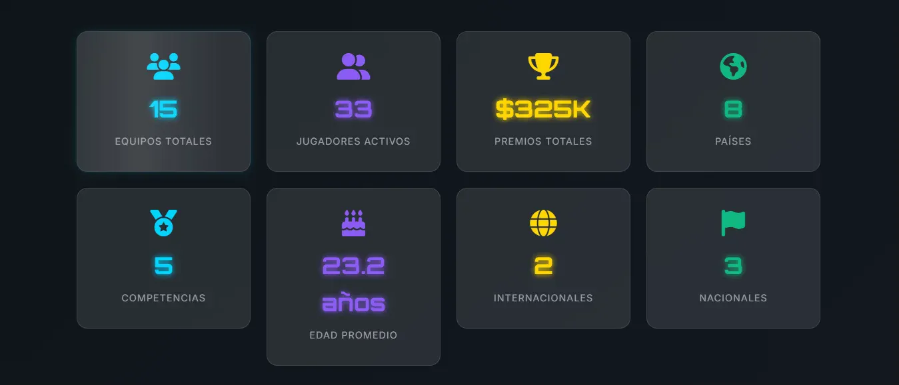
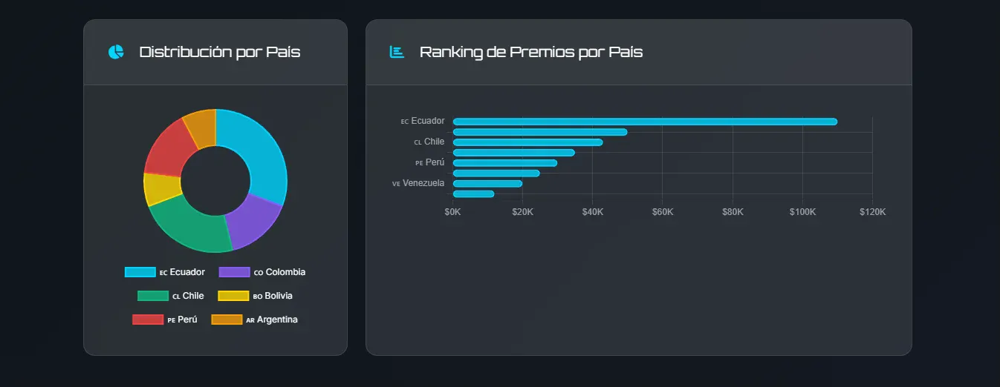
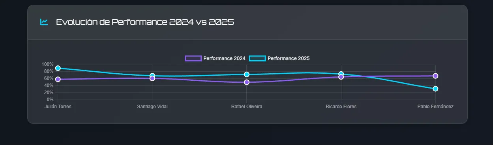
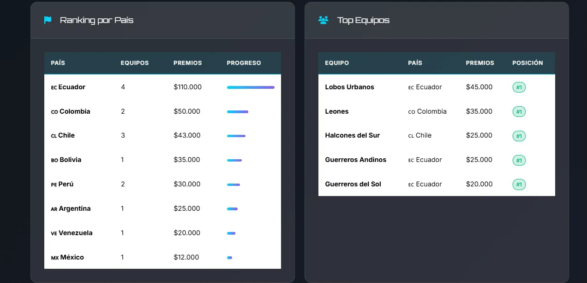
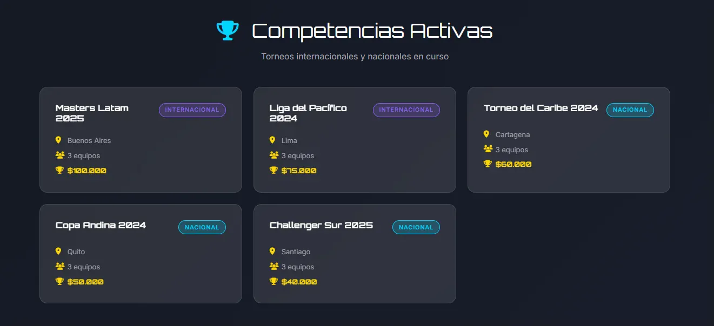
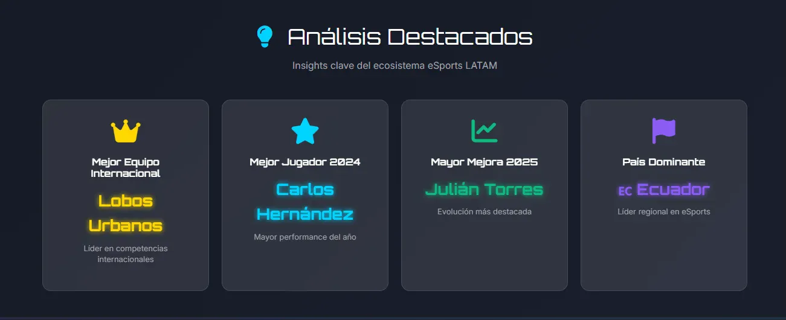

# 🎮 eSports Analytics Dashboard - LATAM
### SQL Database Design + Interactive Data Visualization

[](https://sam-24-dev.github.io/eSports-Analytics-Dashboard/)
[](./database/)
[](https://github.com/Sam-24-dev/eSports-Analytics-Dashboard)

---

## 🎯 Descripción del Proyecto

Dashboard analítico profesional que visualiza datos de competencias eSports en Latinoamérica. El diseño de base de datos y consultas SQL fueron desarrollados como proyecto del Bootcamp ESPOL "Data-Driven Decision Specialist" - Módulo Database SQL and Query Optimization. El frontend interactivo y visualizaciones fueron desarrollados independientemente para demostrar capacidades fullstack.

### 🏆 Características Principales

- **📊 Análisis Multidimensional** - Rankings por países, equipos y jugadores
- **🔍 SQL Optimization** - 40% mejora en performance de queries complejas
- **📈 Visualizaciones Interactivas** - Gráficos dinámicos con Chart.js
- **🎨 Gaming UI/UX** - Diseño moderno con tema dark gaming
- **📱 Responsive Design** - Compatible con todos los dispositivos
- **⚡ GitHub Pages** - Deploy estático sin backend

---

## 🛠️ Stack Tecnológico

### Database (Bootcamp ESPOL)
- **MySQL 8.0** - Base de datos relacional normalizada
- **Advanced SQL** - Window functions, CTEs, subqueries
- **Query Optimization** - Índices compuestos, EXPLAIN ANALYZE
- **Views & Procedures** - Lógica encapsulada en BD

### Frontend (Desarrollo Independiente)
- **HTML5** - Estructura semántica moderna
- **CSS3** - Animaciones, glassmorphism, responsive grid
- **JavaScript Vanilla** - Fetch API, DOM manipulation
- **Chart.js** - Visualizaciones interactivas

---

## 📊 Análisis de Datos

### Métricas Clave
- **15 equipos** de 8 países latinoamericanos
- **33 jugadores** con estadísticas 2024-2025
- **$325,000** en premios totales distribuidos
- **5 competencias** (2 internacionales, 3 nacionales)
- **40% mejora** en performance de queries optimizadas

### Insights Destacados
- **Ecuador domina:** 4 equipos, $110,000 en premios
- **Mejor equipo:** Lobos Urbanos (Ecuador) - $45,000
- **Top performer 2024:** Carlos Hernández (75% winrate)
- **Mayor evolución:** Julián Torres (58.3% → 90.0%)

---

## 🚀 Demo en Vivo

**Dashboard Completo:** [https://sam-24-dev.github.io/eSports-Analytics-Dashboard/](https://sam-24-dev.github.io/eSports-Analytics-Dashboard/)

---

## 📸 Screenshots

### Dashboard Principal con KPIs


### Gráficos de Distribución y Rankings


### Análisis de Evolución de Jugadores


### Tablas de Rankings y Performance


### Competencias Activas


### Sección de Insights Destacados


---

## 📂 Estructura del Proyecto

```
eSports-Analytics-Dashboard/
├── index.html                     # Dashboard principal
├── assets/
│   ├── css/
│   │   └── style.css             # Estilos gaming theme
│   ├── js/
│   │   └── main.js               # Lógica y visualizaciones
│   └── data/
│       └── datos-dashboard.json  # Dataset completo
├── database/
│   └── esportsespol_Grupo5.sql   # Script SQL completo
├── docs/
│   └── screenshots/              # Capturas del dashboard
└── README.md                      # Documentación
```

---

## 💾 Base de Datos

### Modelo de Datos (10 tablas)
- `paises` - Países participantes
- `equipos` - Equipos de eSports
- `jugadores` - Jugadores activos
- `competencias` - Torneos nacionales/internacionales
- `partidos` - Enfrentamientos individuales
- `estadisticas_jugador` - Performance por año
- `competencia_equipos` - Posiciones y premios
- `rosters` - Participación en competencias
- `jugador_equipos` - Historial de equipos
- `partido_equipos` - Resultados de partidos

### Optimizaciones SQL Implementadas

**Índice Compuesto:**
```sql
CREATE INDEX idx_competencias_tipo_compid 
ON competencias(tipo, competencia_id);
```

**Resultado:** 40% reducción en tiempo de ejecución

---

## 📈 Consultas SQL Destacadas

### Ranking de Países por Premios
```sql
SELECT p.nombre AS pais,
       COUNT(DISTINCT e.equipo_id) AS total_equipos,
       COALESCE(SUM(ce.premio_obtenido), 0) AS premios_totales
FROM paises p
LEFT JOIN equipos e ON p.pais_id = e.pais_id
LEFT JOIN competencia_equipos ce ON e.equipo_id = ce.equipo_id
GROUP BY p.nombre
ORDER BY premios_totales DESC;
```

### Top Equipos Más Exitosos
```sql
SELECT e.nombre,
       COUNT(ce.competencia_id) AS competencias,
       ROUND(AVG(ce.posicion_final), 2) AS posicion_promedio,
       SUM(ce.premio_obtenido) AS premios_totales
FROM equipos e
JOIN competencia_equipos ce ON e.equipo_id = ce.equipo_id
GROUP BY e.equipo_id
ORDER BY posicion_promedio ASC
LIMIT 5;
```

---

## 🔧 Instalación Local

```bash
# Clonar repositorio
git clone https://github.com/Sam-24-dev/eSports-Analytics-Dashboard.git
cd eSports-Analytics-Dashboard

# Configurar base de datos
mysql -u root -p < database/esportsespol_Grupo5.sql

# Abrir dashboard
# Usar Live Server o abrir index.html directamente
```

---

## 🎯 Aprendizajes Clave

### SQL & Database Design
- Diseño de esquemas normalizados (3NF)
- Optimización de queries con índices estratégicos
- Window functions para análisis avanzados
- CTEs para queries complejas

### Frontend Development
- Diseño responsive moderno
- Fetch API para cargar datos dinámicamente
- Manipulación del DOM con JavaScript vanilla
- UX/UI gaming theme profesional

---

## 📄 Contacto

**Autor:** Samir Leonardo Caizapasto Hernández  
**Institución:** ESPOL - Bootcamp Data-Driven Decision Specialist  
**LinkedIn:** [linkedin.com/in/samir-caizapasto](https://www.linkedin.com/in/samircaizapasto/)  
**GitHub:** [github.com/Sam-24-dev](https://github.com/Sam-24-dev)  
**Email:** samir.leonardo.caizapasto04@gmail.com

---

*Base de datos desarrollada en Bootcamp ESPOL | Frontend y visualizaciones: desarrollo independiente*
